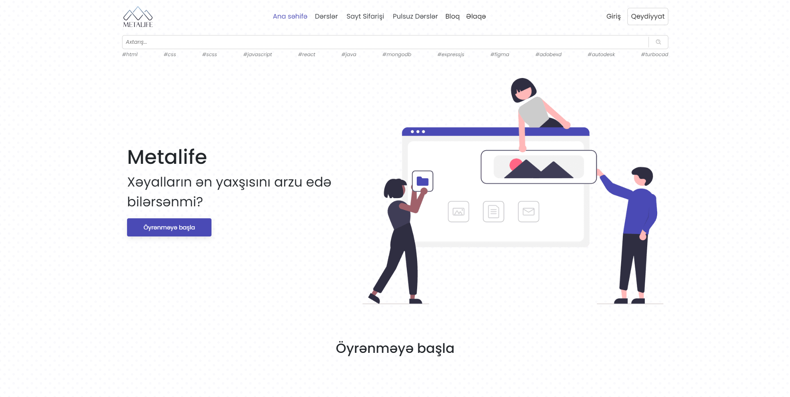

Metalife is a company dedicated to managing freelance projects and teaching programming. Our platform enables users to efficiently handle their projects while providing valuable educational resources.

## Table of Contents

- [Screenshots](#screenshots)
- [Features](#features)
- [Technologies Used](#technologies-used)
- [Installation](#installation)
- [License](#license)
- [Acknowledgements](#acknowledgements)

## Screenshots



## Features

- Interactive programming tutorials
- User authentication and profile management
- Responsive and mobile-friendly design

## Technologies Used

- **React**: For building dynamic user interfaces.
- **Firebase**: For backend services including authentication, storage, and cloud functions.
- **Bootstrap**: For responsive and mobile-first design.
- **Sass**: For advanced and modular CSS.
- **Swiper**: For implementing touch sliders and carousels.
- **Framer Motion**: For creating animations and transitions.
- **AOS (Animate On Scroll)**: For scroll animations
- **React Router DOM**: For routing and navigation management.
- **React Helmet Async**: For managing changes to the document head.
- **React Hot Toast**: For customizable toast notifications.

## Installation

### Prerequisites

- Node.js (>= 14.x)
- npm or yarn
- Firebase CLI

### Steps

1.  **Clone the repository:**

    ```sh
    git clone https://github.com/Anrsgrl/metalife
    ```

2.  **Navigate to the project directory:**

    ```sh
    cd metalife
    ```

3.  **Install dependencies:**

    ```sh
    npm install
    # or
    yarn install
    ```

4.  **Set up Firebase:**

        Create a `.env` file in the root directory and add your Firebase configuration:

        ```env
        NEXT_PUBLIC_FIREBASE_API_KEY=your_api_key
        NEXT_PUBLIC_FIREBASE_AUTH_DOMAIN=your_auth_domain
        NEXT_PUBLIC_FIREBASE_PROJECT_ID=your_project_id
        NEXT_PUBLIC_FIREBASE_STORAGE_BUCKET=your_storage_bucket
        NEXT_PUBLIC_FIREBASE_MESSAGING_SENDER_ID=your_messaging_sender_id
        NEXT_PUBLIC_FIREBASE_APP_ID=your_app_id
        REACT_APP_ADMIN_KEY=your_admin_key
        REACT_APP_ADMIN_PASS=your_admin_password
        REACT_APP_TEACHER_PASS=your_teacher_password
        REACT_APP_EMAIL_SERVICE_ID=your_email_service_id
        REACT_APP_PRIVATE_KEY=your_private_key
        ```

5.  **Start the development server:**

```sh
npm start
# or
yarn dev
```

## License

This project is licensed under the MIT License. See the [LICENSE](LICENSE) file for more details.

## Acknowledgements

This project was created some time ago and it was my first major project. There might be some mistakes, and I appreciate your understanding! Thank you for your support.
